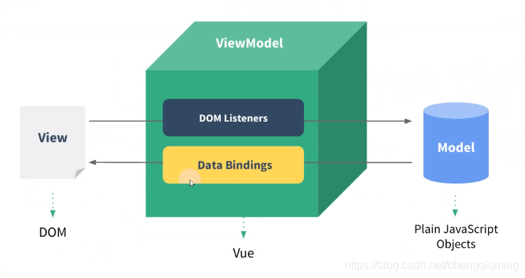
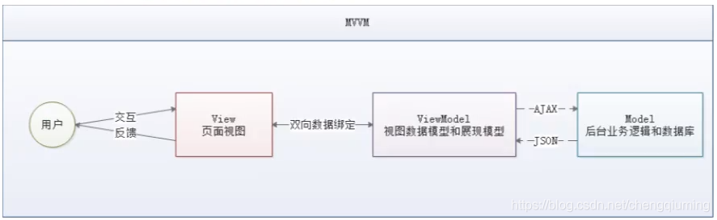
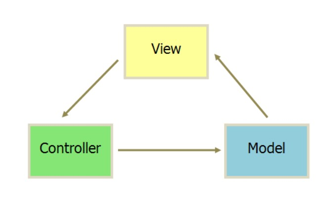

# 什么是MVVM

+ 1. view的数据同步到viewModel层是通过Dom Listeners
+ 2. model的数据下发到viewModel层后通过Data Bindings显示到view上
---
## 特点

+ 1. view与model不直接通信,通过viewModel实现
+ 2. viewModel与view, viewModel与model都是双向通信的

+ 3. 低耦合view独立于model
+ 4. 可复用让view的逻辑放在viewModel中,让view可以复用这些逻辑
+ 5. 数据驱动
+ 6. 方便测试,测试不用关心view只关心viewModel来测试
---

# 什么是MVC

+ 1. View 传送指令到 Controller
+ 2. Controller 完成业务逻辑后，要求 Model 改变状态
+ 3. Model 将新的数据发送到 View，用户得到反馈
---

## 特点
+ 1. view与control没有完全分离和重用
+ 2. 通信是单向的
+ 3. 因为没有对view抽离导致无法重用
---
