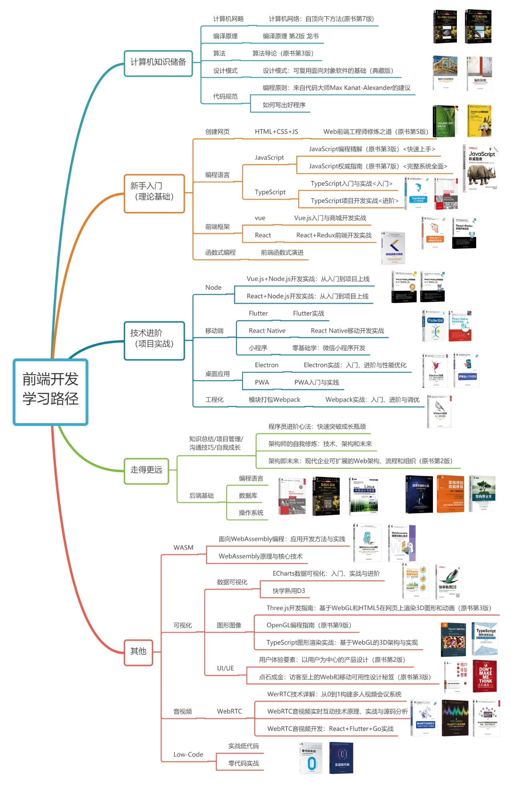

# 前端知识体系

## 基础

### html

### js

### css

## typeScript

## 计算机网络

## 数据结构与算法

## 单元测试

## 工程化与基础建设

### node基础脚手架

### 基本编译原理

### 构建工具

- webpack
- rollup
- esbuild

### 组件库

### 微前端

### 低代码

## 监控

### 性能监控

### 异常监控

## 埋点

## 可视化

### canvas

### webgl

## 跨端

### flutter

### jsbridge

## 小程序

### 微信小程序

### uniapp

### taro

## 框架

### vue

### react

## 团队协作

### git

### eslint

### commitlint

### code review

## DevOps

### docker

### nginx

### jenkins

### CI/CD

## 浏览器

### web安全

### 渲染过程

### 同源策略

### 性能优化

