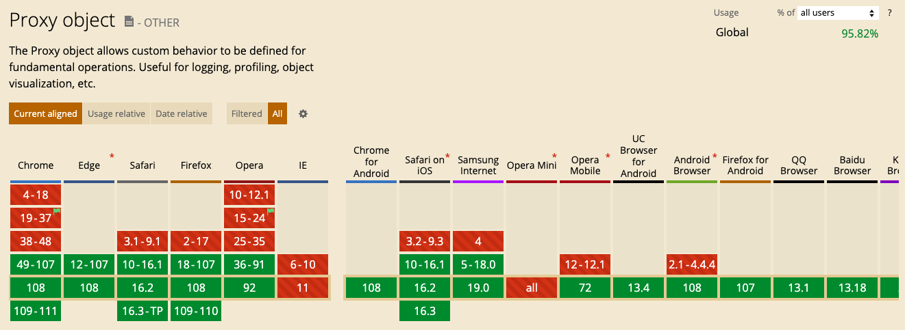
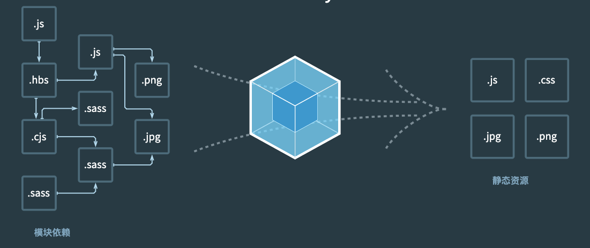

# vue3+webpack开发框架

- vue3: 渐进式javaScript框架
- webpack: 前端静态文件构建工具

## vue3

### 什么时候使用vue3，什么时候不适用

不适用:

- 需要支持IE11 
- 不支持proxy object语法的浏览器
- 有历史遗留问题，项目已经是vue2现在要全部使用新特性来升级到vue3

适用:

- 优越的性能 速度更快 可维护 (vue2将不在维护了)
- 未来的趋势

### vue2与vue3不同

|区别点|描述|
|---|---|
|创建新应用的脚手架|Vue Cli|
|安装方式|vue2: npm install vue@2.x.x   vue3: npm install vue|
|多根入口|vue2只能有一个根入口而vue3可以在template中写多个根入口|
|组合式API|vue2: 选项式API: 把逻辑剥离到不同的属性里面 vue3: 组合式API 把逻辑剥离到function里面。从逻辑复用的角度来组合里的代码，而不是从属性选项维度。|
|生命周期|在vue2里面生命周期可以直接在选项组件里直接使用,但是在vue3里所有的包括声明周期都是方法,这些方法也要被导入才能使用|
|计算属性|在vue2中需要单独添加computed属性,在vue3里面需要导入computed然后在setup的方法中使用|
|props|关键字this总是用来指代组件而不是任何特定的属性，vue3里面不在使用this,而是采用props和context参数来访问props|
|事件触发|vue2里面使用this.$emit来传递数据给父组件, 而vue3里添加了context.emit来传递数据给父组件|
|portals|将组件内的一部分模板传送到组件外部去渲染|

总结：

- Composition API（组合式API）: 通过逻辑来组织代码而不是属性，这样代码的可读性随着代码量的大大增高
- Lifecycle Hooks（生命周期）： vue3可以根据你的内容将生命周期组合起来，而vue2必须写在一起
- Fragments（碎片）：vue2一个模板必须只有一个根目录，而vue3允许多个根目录，这样可以节省不必要的包装元素
- Teleport（传送）： 在弹出框或者模态框里面，可以利用Teleport组件将代码传递到外层dom结构里面

### 兼容性

## webpack

本质上，webpack 是一个用于现代 JavaScript 应用程序的 静态模块打包工具。当 webpack 处理应用程序时，它会在内部从一个或多个入口点构建一个 依赖图(dependency graph)，然后将你项目中所需的每一个模块组合成一个或多个 bundles，它们均为静态资源，用于展示你的内容。

缺点：

- 大型项目（代码行数：100W+） 启动项目需要几分钟 
- 每次实时更改代码的时候 需要几秒钟才能反应到页面上

由于现阶段一些已知的原因， 暂时采用这种构建方式

## 参考
 
- [Vue 2 vs. Vue 3: What Are the Differences and Which Version Should You Choose?](https://www.trio.dev/blog/vue-2-vs-vue-3)
- [webpack5](https://webpack.docschina.org/concepts/)