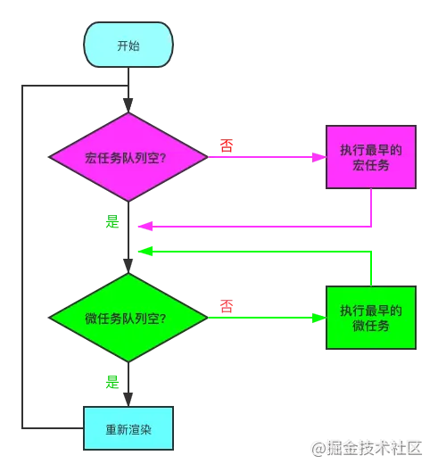

# 事件循环

我们都知道 Js 是单线程都，但是一些高耗时操作就带来了进程阻塞问题。为了解决这个问题，Js 有两种任务的执行模式：同步模式（Synchronous）和异步模式（Asynchronous）

## 异步模式: 宏任务与微任务

ES6 规范中，宏任务（Macrotask） 称为 Task， 微任务（Microtask） 称为 Jobs。
- 宏任务是由宿主（浏览器、Node）发起的
- 微任务由 JS 自身发起。

| 宏任务 | 微任务 |
|  ----  | ----  |
| setTimeout | requestAnimationFrame（有争议） |
| setInterval | MutationObserver（浏览器环境） |
| MessageChannel | Promise.[ then/catch/finally ] |
| I/O，事件队列 | process.nextTick（Node环境） |
| setImmediate（Node环境） | queueMicrotask |
| script（整体代码块） |  |

## EventLoop

1. 判断宏任务队列是否为空

不空 --> 执行最早进入队列的任务 --> 执行下一步
空 --> 执行下一步

2. 判断微任务队列是否为空

不空 --> 执行最早进入队列的任务 --> 继续检查微任务队列空不空
空 --> 执行下一步

因为首次执行宏队列中会有 script（整体代码块）任务，所以实际上就是 Js 解析完成后，在异步任务中，会先执行完所有的微任务，这里也是很多面试题喜欢考察的。需要注意的是，新创建的微任务会立即进入微任务队列排队执行，不需要等待下一次轮回。
