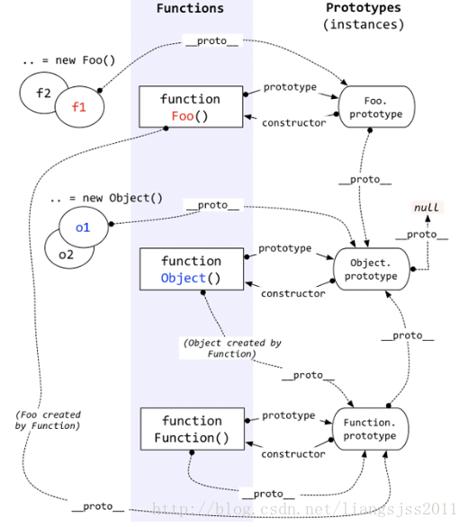

# 原型与原型链

在传统的 OOP 中，首先定义“类”，此后创建对象实例时，类中定义的所有属性和方法都被复制到实例中。在 JavaScript 中并不如此复制——而是在对象实例和它的构造器之间建立一个链接（它是__proto__属性，是从构造函数的prototype属性派生的），之后通过上溯原型链，在构造器中找到这些属性和方法。

## 什么是原型

JavaScript是基于原型的语言,每一个对象所有一个原型,对象依照原型为模板,从而继承属性与方法

## 什么是原型链

对象的原型也有原型,当访问对象的属性或者方法的时候,先查找自身上查找,如果没有就从原型对象上查找,已知查找到最顶层null,如果还没有就返回undefined



注意: Function原型的问题

```js
// 函数的原型
Function.prototype
ƒ () { [native code] }

// 函数原型的constructor指向函数本身
Function.prototype.constructor
ƒ Function() { [native code] }

// 函数的原型对象的__proto__指向Object对象
Function.prototype.__proto__
{
    constructor: ƒ, 
    __defineGetter__: ƒ, 
    __defineSetter__: ƒ, 
    hasOwnProperty: ƒ, 
    __lookupGetter__: ƒ, 
    ...
}

// 重点函数的__proto__指向函数的原型对象
Function.__proto__
ƒ () { [native code] }

// 意思是 :
Function.__proto__ === Function.prototype // true
```

## prototype 属性：继承成员被定义的地方

+ 继承的属性和方法是定义在 prototype 属性之上的（你可以称之为子命名空间 (sub namespace) ）——那些以 Object.prototype. 开头的属性，而非仅仅以 Object. 开头的属性。prototype 属性的值是一个对象，我们希望被原型链下游的对象继承的属性和方法，都被储存在其中。

+ 于是 Object.prototype.watch()、Object.prototype.valueOf() 等等成员，适用于任何继承自 Object() 的对象类型，包括使用构造器创建的新的对象实例。

+ Object.is()、Object.keys()，以及其他不在 prototype 对象内的成员，不会被“对象实例”或“继承自 Object() 的对象类型”所继承。这些方法/属性仅能被 Object() 构造器自身使用。


## __proto__的问题

+ 没有官方的方法用于直接访问一个对象的原型对象——原型链中的“连接”被定义在一个内部属性中，在 JavaScript 语言标准中用 [[prototype]] 表示（参见 ECMAScript）。然而，大多数现代浏览器还是提供了一个名为 __proto__ （前后各有2个下划线）的属性，其包含了对象的原型.

+ 一般不直接修改__proto__因为修改了会导致继承这个原型的实例对象都会被修改,这样会影响到性能

