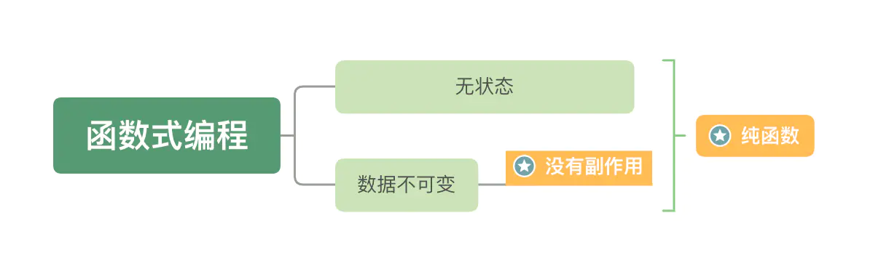

# 编程范式

## 命令式(结构化,面向过程编程)

### 概念
+ 1. 自顶向下，逐步求精。将编写程序看成是一个逐步演化的过程，将分析问题的过程划分成若干个层次，每一个新的层次都是上一个层次的细化
+ 2. 模块化。将系统分解成若干个模块，每个模块实现特定的功能，最终的系统由这些模块组装而成，模块之间通过接口传递信息。
+ 3. 语句结构化。在每个模块中只允许出现顺序、选择和循环三种流程结构的语句。 

程序 = 数据结构 + 算法

### 优缺点

+ 1. (优)贴近硬件语言,性能比较高
+ 2. (优)逻辑清晰
+ 3. 数据全局访问,带来的更大的耦合,单个测试模块比较复杂
+ 4. 抽象能力较弱

## 函数式

### 概念
函数式编程中的函数不是结构化编程中的函数，而是数学中的函数，结构化编程中的函数是一个过程（Procedure）

程序 = 数据 + 函数

### 特点
+ 1. 函数是一等公民。一等公民的含义：（1）它可以按需创建；（2）它可以存储在数据结构中；（3）它可以当作参数传给另一个函数；（4）它可以当作另一个函数的返回值
+ 2. 纯函数。所谓纯函数，是符合下面两点的函数：（1）对于相同的输入，返回相同的输出；（2）没有副作用


+ 3. 惰性求值。惰性求值是一种求值策略，它将求值的过程延迟到真正需要这个值的时候

+ 4. 不可变数据。函数式编程的不变性主要体现在值和纯函数上。值一旦创建，就不能修改，除非重新创建。值保证不会显式修改一个数据，纯函数保证不会隐式修改一个数据。当你深入学习函数式编程时，会遇到无副作用、无状态和引用透明等说法，其实都是在讨论不变性

    + 4.1 数据不可变： 它要求你所有的数据都是不可变的，这意味着如果你想修改一个对象，那你应该创建一个新的对象用来修改，而不是修改已有的对象。
    + 4.2 无状态： 主要是强调对于一个函数，不管你何时运行，它都应该像第一次运行一样，给定相同的输入，给出相同的输出，完全不依赖外部状态的变化。
    + 4.3 无副作用: 副作用指函数计算结果的过程中，系统状态的变化，或者函数内部和外部进行交互，产生其他影响常见的副作用：更改全局变量、发送http请求、dom查询

+ 5. 递归。函数式编程用递归作为流程控制的机制，一般为尾递归

### 函数式编程的操作

+ 1. 柯里化Currying:
```js
    f(a,b,c) → f(a)(b)(c)
    
    const add = x => y => x + y
    add(1)(2) 3
```
+ 2. 函数组合Compose
```js
    compose(f, g, t) => x => f(g(t(x))

    const compose = 
    (...fns) => 
    (...args) => 
    fns.reduceRight((val, fn) => fn.apply(null, [].concat(val)), args)

    const f = x => x + 1;
    const g = x => x * 2;
    const t = (x, y) => x + y;

    let fgt = compose(f, g, t);
    fgt(1, 2); // 3 -> 6 -> 7

```

### 优缺点
+ 1. (优)它的着眼点是函数，而不是过程，它强调的是如何通过函数的组合变换去解决问题，而不是我通过写什么样的语句去解决问题，当你的代码越来越多的时候，这种函数的拆分和组合就会产生出强大的力量
+ 2. (优)代码简介
+ 3. (缺)性能不好容易过度抽象
+ 4. 内存容易占用过高


## 面向对象

### 概念

面向对象的程序设计把计算机程序视为一组对象的集合，而每个对象都可以接收其他对象发过来的消息，并处理这些消息，计算机程序的执行就是一系列消息在各个对象之间传递。

程序 = 实体 + 关系

### 特点

+ 1. 封装
    + 1.1 面向对象的根基，它将紧密相关的信息放在一起，形成一个逻辑单元。我们要隐藏数据，基于行为进行封装，最小化接口，不要暴露实现细节。
+ 2. 继承
    + 2.1 继承分为两种，即实现继承和接口继承。实现继承是站在子类的视角看问题，而接口继承是站在父类的视角看问题
+ 3. 多态
    + 3.1 接口继承是常见的一种多态的实现方式。正因为多态的存在，软件设计才有了更大的弹性，能够更好地适应未来的变化。只使用封装和继承的编程方式，我们称之为基于对象编程，而只有把多态加进来，才能称之为面向对象编程。可以这么说，面向对象设计的核心就是多态的设计。
    + 3.2 允许将子类类型的指针赋值给父类类型的指针。即同一操作作用于不同的对象，可以有不同的解释，产生不同的执行结果。多态的表现方式有重写，重载和接口，原生 JS 能够实现的多态只有重写。