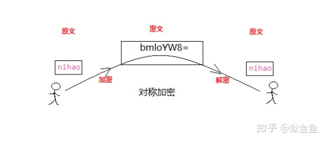
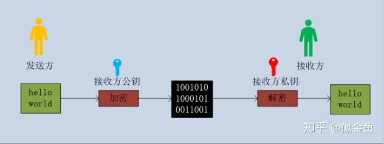

# 请求加解密的逻辑

# 对称加密(AES)

加密过程如下：使用同一把秘钥

- 加密：原文 + 密匙 = 密文

- 解密：密文 - 密匙 = 原文

# 非对称加密(RSA)

公钥解密私钥解密:

- 非对称加密有两个钥匙，及公钥（Public Key）和私钥（Private Key）。公钥和私钥是成对的存在，如果对原文使用公钥加密，则只能使用对应的私钥才能解密；因为加密和解密使用的不是同一把密钥，所以这种算法称之为非对称加密算法

- 对于原文，通过发送方的公钥进行加密，发送给接收方，接收方拿到密文后，通过自己的私钥可以解密，获取原文信息。

# 前端请求的加解密流程

- 1. 先利用RSA来加密一段固定格式的随机字符串
- 2. 随机字符串的格式`${Date.now()}:${16位随机字符串}`
- 3. 后台将16位随机字符串作为秘钥进行AES加密
- 4. 前端收到数据后利用随机字符串进行反解密