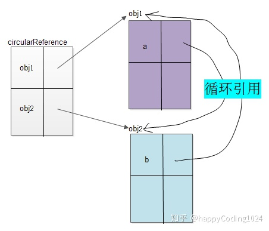

# 循环引用



```js
// 两个对象相互引用
let obj1 = {};

let obj2 = {
    a: obj1
}

obj1.b = obj2;
```

# 垃圾回收机制

## 引用计数

当对象的地址被引用一次,那么此对象的地址的引用计数+1,当减少变量去指向指这个地址时,对象地址的引用-1

问题是:

循环引用的时候,上面的obj1指向对应的地址,引用计数+1;而obj2的a属性又指向obj1对应的地址,那么obj1对象的引用地址又+1,此时清空obj1这个变量,但是obj1对应的引用计数只是-1,并没被清空

## 标记清楚

最开始的时候将所有的变量加上标记，当执行 cycularReference 函数的时候会将函数内部的变量这些标记清除，在函数执行完后再加上标记。这些被清除标记又被加上标记的变量就被视为将要删除的变量，原因是这些函数中的变量已经无法被访问到了

解决了上面的循环引用问题