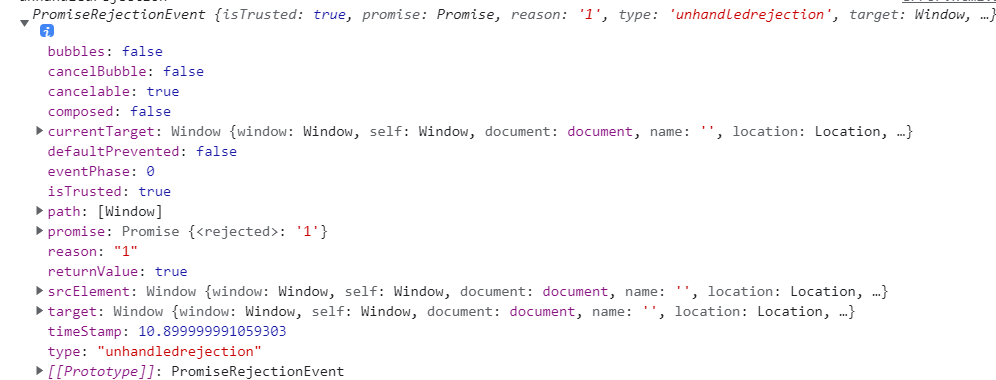

# 异常监控

# JavaScript报错处理方式

## try...catch...方式

能捕捉到的异常，必须是线程执行已经进入 try catch 但 try catch 未执行完的时候抛出来的,以下是不能被监控的

- 异步任务抛出的异常（执行时try catch已经从执行完了）
- promise（异常内部捕获到了，并未往上抛异常，使用catch处理）
- 语法错误（代码运行前，在编译时就检查出来了的错误）
- 优点：能够较好地进行异常捕获，不至于使得页面由于一处错误挂掉
- 缺点：显得过于臃肿，大多代码使用try ... catch包裹，影响代码可读性。

```js
function errFunc() {
    // eslint-disable-next-line no-undef
    error;
}

function catchError() {
    try {
        this.errFunc();
    } catch (error) {
        console.log(error);
    }
}
catchError()
```

## 全局异常监听window.onerror

window.onerror 最大的好处就是同步任务、异步任务都可捕获，可以得到具体的异常信息、异常文件的URL、异常的行号与列号及异常的堆栈信息，再捕获异常后，统一上报至我们的日志服务器，而且可以全局监听，代码看起来也简洁很多。
缺点：

- 此方法有一定的浏览器兼容性
- 无法捕获promise的错误
- 跨域脚本无法准确捕获异常，跨域之后window.onerror捕获不到正确的异常信息，而是统一返回一个Script error，可通过在<script>使用crossorigin属性来规避这个问题

```js
window.addEventListener('error', function() {
  console.log(error);
  // ...
  // 异常上报
});
throw new Error('这是一个错误');
```

## Promise内部异常

前文已经提到，onerror 以及 try-catch 也无法捕获Promise实例抛出的异常，只能最后在 catch 函数上处理，但是代码写多了就容易糊涂，忘记写 catch。
如果你的应用用到很多的 Promise 实例的话，特别是在一些基于 promise 的异步库比如 axios 等一定要小心，因为你不知道什么时候这些异步请求会抛出异常而你并没有处理它，所以最好添加一个 Promise 全局异常捕获事件 unhandledrejection



```js
window.addEventListener("unhandledrejection", e => {
    console.log('unhandledrejection',e)
});
```

## vue工程异常

window.onerror并不能捕获.vue文件发生的获取，Vue 2.2.0以上的版本中增加了一个errorHandle，使用Vue.config.errorHandler这样的Vue全局配置，可以在Vue指定组件的渲染和观察期间未捕获错误的处理函数。这个处理函数被调用时，可获取错误信息和Vue 实例

```js
//main.js
import { createApp } from "vue";
import App from "./App.vue";

let app = createApp(App);
app.config.errorHandler = function(e) {
  console.log(e);
  //错误上报...
};
app.mount("#app");
```

## 终极版本

```js
import { createApp } from "vue";
import App from "./App.vue";

let app = createApp(App);

window.addEventListener(
  "error",
  (e) => {
    console.log(e);
    //TODO:上报逻辑
    return true;
  },
  true
);
// 处理未捕获的异常，主要是promise内部异常，统一抛给 onerror
window.addEventListener("unhandledrejection", (e) => {
  throw e.reason;
});
// 框架异常统一捕获
app.config.errorHandler = function(err, vm, info) {
  //TODO:上报逻辑
  console.log(err, vm, info);
};
app.mount("#app");
```

## sourcemap

## 参考
[前端异常埋点系统初探](https://juejin.cn/post/6965022635470110733#heading-3)
