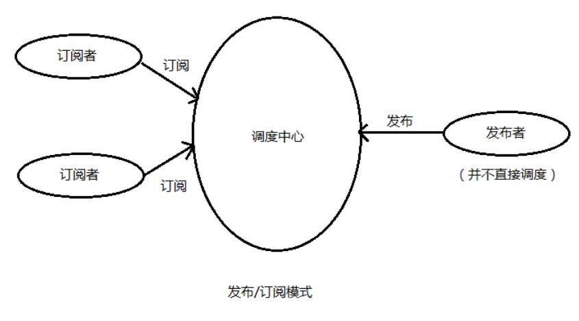
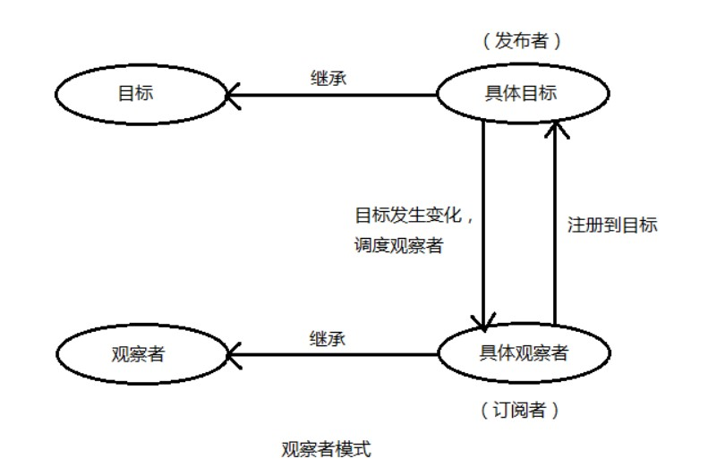

# 设计模式

## 工厂模式

提供一个类，创造出属性方法都相同的实例

```js
function person (name) {
   this.name = name
}

person.prototype.sayHi() {
   console.log('hi')
}

var p1 = new person()
var p2 = new person()
```

## 单例模式

限制一个类智能有一个实例对象，广义的定义： 一个变量就是一个单例模式,优点： 每个类都只有一个实例，这样可以大大节省空间

### 懒汉模式

```js
class single {
   static instacne = new single() 

   constructor(name) {
      this.name = name
   }
}
```

### 饿汉模式

```js
class single {
   static instacne 

   constructor(name) {
      this.name = name
   }

   getInstance() {
      single.instance = new single()
   }
}
```

## 策略模式

将算法的使用与算法的实现分离开来,解决if-else 嵌套太深的问题

```js
let obj = {
    userName: 'lisi',
    phone: "",
    cardType: 'id',
    cardNum: '666'
}

let { userName,phone,cardType,cardNum } = obj

const rules = [
    { valid: userName, err: '请输入姓名' },
    { valid: phone, err: '请输入电话号码' },
    { valid: cardType, err: '请输入证件类型' },
    { valid: cardNum, err: '请输入证件号码' }
]

for(let val of rules) {
    if(!val.valid) {
      throw(val.err)
      break
    }
}
```


## 装饰器模式

给一个类增加特有的方法与属性，目的是解决不同类共享的问题

```js
// @run 就是给类属性方法(speak)加的一个装饰器（其实也就是一个函数） 扩展了类Boy的speak(在讲话的同时跑步)
class Boy{
  @run
  speak (){
    console.log('I can speak')
  }
}
function run () {
  console.log('I can run')
}

let tj =  new Boy()
tj.speak()

```

## 发布-订阅模式

1. 基于主题-事件的模式，发布者发布一个主题，订阅者通过事件监听主题，发布者与订阅者耦合程度非常低,应用： pubsub.js
2. 缺点： 不知道是谁发，也不知是谁监听，如果工程过大，这样数据就被能不监控



```js
function Publish() {
   // 存放事件主题
   this.topics = []
  
   //触发
   this.emit = function (topicName,payload) {
     this.topics.push({ topicName,payload }) 
   }
   
   //监听
   this.on = function (topicName, callback) {
    this.topics.forEach(_ => { 
        if(_.topicName == topicName) {
            callback(_.payload)
        }
    })
  }
}

const bus = new Publish();
bus.emit('event', 2);
bus.on('event', (res) => {
    console.log(res); // 2
});
```


## 观察者模式

1. 一个对象（称为subject）维持一系列依赖于它的对象（称为observer），将有关状态的任何变更自动通知给它们（观察者）。

2. 目标对象(subject)与观察者(observe)之间有很强的依赖性



```js
//遍历传入实例的data对象的属性，将其设置为Vue对象的访问器属性
function observe(obj,vm) {
    Object.keys(obj).forEach(function(key) {
        defineReactive(vm,key,obj[key]);
    });
}

//设置为访问器属性，并在其getter和setter函数中，使用订阅发布模式。互相监听。
function defineReactive(obj,key,val){
     //这里用到了观察者(订阅/发布)模式,它定义了一种一对多的关系，让多个观察者监听一个主题对象，这个主题对象的状态发生改变时会通知所有观察者对象，观察者对象就可以更新自己的状态。
     //实例化一个主题对象，对象中有空的观察者列表
     var dep = new Dep();
     //将data的每一个属性都设置为Vue对象的访问器属性，属性名和data中相同
     //所以每次修改Vue.data的时候，都会调用下边的get和set方法。然后会监听v-model的input事件，当改变了input的值，就相应的改变Vue.data的数据，然后触发这里的set方法
     Object.defineProperty(obj,key,{
         get: function(){
             //Dep.target指针指向watcher，增加订阅者watcher到主体对象Dep
             if(Dep.target){
                dep.addSub(Dep.target);
             }
             return val;
         },
         set: function(newVal){
             if(newVal === val){
                 return
             }
             val = newVal;
             //console.log(val);
             //给订阅者列表中的watchers发出通知
             dep.notify();
         }
     });
 }
 
//主题对象Dep构造函数
function Dep(){
    this.subs = [];
}
//Dep有两个方法，增加订阅者  和  发布消息
Dep.prototype = {
    addSub: function(sub){
        this.subs.push(sub);
    },
    notify: function(){
        this.subs.forEach(function(sub){
            sub.update();
        });
    }
}
```
## 观察者模式与发布订阅模式的区别

- 虽然两种模式都存在订阅者和发布者（具体观察者可认为是订阅者、具体目标可认为是发布者），但是观察者模式是由具体目标调度的，而发布/订阅模式是统一由调度中心调的，所以观察者模式的订阅者与发布者之间是存在依赖的，而发布/订阅模式则不会。

- 两种模式都可以用于松散耦合，改进代码管理和潜在的复用